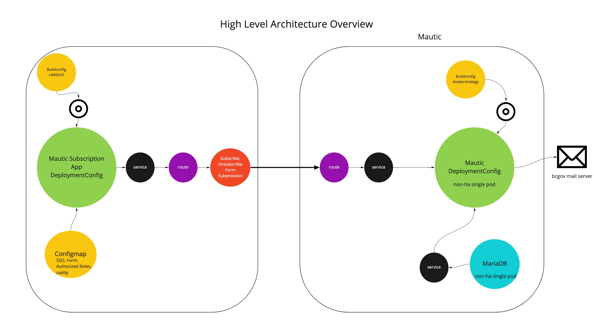

# Architecture Diagram



# Local Development
To run this application locally, first create a `.env` file with the parameters in the `.env.example` file in the api directory or connect to an openshift api deployment by specifying the correct "backendURL" in the form.json file.
As well, update all the parameters in the `public/config` folder.
These values can be referenced from the configmap and secrets in the openshift deployment.

The backend server can be run using the command `go run .` in the api directory.
The frontend can be run using `npm run build` and `npm start`.

# Making Updates
Create a pull request to the main branch, once merged, a new image will be built in the tools namespace and re-tagged in the dev namespace and a new deployment will be up in dev. Once sufficient testing is done, trigger the deploy-in-prod and deploy-in-prod-api workflow to update the prod deployment.
If the application needs to be recreated, please refer to the steps below.

# Setting up Mautic Subscription App on Openshift

Start by granting imagepull access to the tools namespace for the dev, test, and prod namespaces
`oc process -f openshift/mautic.subscribe.rolebindings.yaml -p LICENSE_PLATE=[licenseplate-name] | oc apply -f -`
- Example: 

    `oc process -f openshift/mautic.subscribe.rolebindings.yaml -p LICENSE_PLATE=de0974 | oc apply -f -`

## Setting up caddy s2i
Create a new build config for caddy using the command: 
`oc process -f https://raw.githubusercontent.com/bcgov/s2i-caddy-nodejs/master/openshift/templates/build.yaml | oc apply -f -`

The OCP builder will need to pull a base image from the RedHat Container Registry. To let your builder do this, sign-up for a free RedHat Developer to this [site](https://catalog.redhat.com/software/containers/search). Once you have credentials, create a secret the builder can use to pull image from the catalog:
`oc create secret docker-registry rh-registry --docker-server=registry.redhat.io --docker-username=<USERNAME> --docker-password=<PASSWORD> --docker-email=unused`

Link the secret so the builder can use it using the command:
`oc set build-secret --pull bc/caddy-s2i-builder rh-registry`

The final step is to trigger the build which will make the s2i caddy image and store a copy in your namespace:

`oc start-build bc/caddy-s2i-builder --follow`

For more information on the caddy s2i builder, visit [here](https://github.com/bcgov/s2i-caddy-nodejs)

## Building and Deploying the App
#### Setting up openshift parameters
Start by creating a `mautic.subscription.param` file with the parameters in the `openshift/mautic.subscription.param.example` file. 


- Example:
```
APP_NAME=mautic-subscription
SOURCE_REPOSITORY_URL=https://github.com/bcgov/Mautic-Subscription-App
SOURCE_REPOSITORY_REF=main 
TOOLS_NAMESPACE=de0974-tools
DEV_NAMESPACE=de0974-dev
TEST_NAMESPACE=de0974-test
PROD_NAMESPACE=de0974-prod
IMAGE_REGISTRY=image-registry.openshift-image-registry.svc:5000
BACKEND_URL=https://mautic-subscription-api-test-de0974-dev.apps.silver.devops.gov.bc.ca
SSO_REALM=devhub
HOST_ADDRESS=apps.silver.devops.gov.bc.ca
```

#### Setting up keycloak clients
##### Front-end
For each deployment in the dev namespace there must be a keycloak client created for it. The keycloak Client ID should match the deployment config name.

For the test and prod namespaces, one keycloak client for each of the namespaces must be created. Ex// `mautic-subscription-test` and `mautic-subscription-prod`

Keycloak clients should be created with the following properties:
```
Client-ID: [client-id-name]
Enabled: On
Consent Required: Off
Client Protocol: openid-connect
Access Type: public
Standard Flow Enabled: On
Implicit Flow Enabled: Off
Direct Access Grants Enabled: Off
Service Accounts Enabled: Off
Authorization Enabled: Off
Valid Redirect URI: https://[app-name]-[image-tag]-[target-namespace].[host-address]/*
Web Origins: *
```
Additionally, a role should be created with composite roles github-org-bcgov, github-org-bcgov-c, github-org-bcdevops, idir-user.

##### Back-end
For the dev, test, and prod namespaces, one keycloak client for each of the namespaces must be created. Ex// `mautic-subscription-api-dev`, `mautic-subscription-api-test` and `mautic-subscription-api-prod`

Keycloak clients should be created with the following properties:

```
Client-ID: [client-id-name]
Enabled: On
Consent Required: Off
Client Protocol: openid-connect
Access Type: confidential
Standard Flow Enabled: On
Implicit Flow Enabled: Off
Direct Access Grants Enabled: Off
Service Accounts Enabled: On
Authorization Enabled: Off
Valid Redirect URI: *
Web Origins: +
```
Note that the keycloak properties in the `api/.env` file must match those from the corresponding client.

#### Creating the build
##### Web
Create the build using the commands:
`oc process -f openshift/mautic.subscribe.bc.yaml --param-file=openshift/mautic.subscription.param --ignore-unknown-parameters=true -p IMAGE_TAG=pr[pr-number] | oc apply -f - -n [tools-namespace]`
and
`oc start-build -w [app-name]-[image-tag]`

- Example:
`oc process -f openshift/mautic.subscribe.bc.yaml --param-file=openshift/mautic.subscription.param --ignore-unknown-parameters=true -p IMAGE_TAG=pr10 | oc apply -f - -n de0974-tools`
`oc start-build -w mautic-subscription-pr10`

##### API
Create the build using the command:
`oc process -f openshift/mautic.subscribe.api.bc.yaml --param-file=openshift/mautic.subscription.param --ignore-unknown-parameters=true -p IMAGE_TAG=pr[pr-number]| oc apply -f - -n [tools-namespace]`
and 
`oc start-build -w [app-name]-api-[image-tag]`

#### Retag Images
Before deploying the app in the dev/test/prod namespaces run the following command to retag the image from the tools namespace:
`oc tag [tools-namespace]/[app-name]:[image-tag] [target-namespace]/[app-name]:[image-tag]`

Note for best practice, the pr number can be used as the image tag in the dev namespace but in the test/prod namespaces the image tag should be test/prod

- Example to retag the image to the dev namespace:
`oc tag de0974-tools/mautic-subscription:pr10 de0974-dev/mautic-subscription:pr10`

- Example to retag the image to the test namespace:
`oc tag de0974-tools/mautic-subscription:pr10 de0974-test/mautic-subscription:test`

#### Deploying the app
##### Web
If there is already a deploymentConfig in the test/prod namespaces, retagging the images will automatically deploy the application using the updated images and existing configmaps/secrets.

If this is the first time deploying the app in the test/prod namespace, or if this is the first time deploying an app in the dev namespace with the current pr number, follow these steps:

After retagging the image, delete the previously configured configmap if there is one:
`oc delete configmap mautic-config-[image-tag] -n [target-namespace]` 

Then deploy the app in the target namespaces using the command:
`oc process -f openshift/mautic.subscribe.dc.yaml --param-file=openshift/mautic.subscription.param --ignore-unknown-parameters=true -p TARGET_NAMESPACE=[target-namespace] -p SSO_CLIENT_ID=[sso-client-id] -p KEYCLOAK_URL=[keycloak-url] -p SSO_AUTHORIZED_ROLES=[authorized-roles]| oc apply -f - -n [target-namespace]`

- Example deploying to dev:
`oc delete configmap mautic-config-pr10 -n de0974-dev`
`oc process -f openshift/mautic.subscribe.dc.yaml --param-file=openshift/mautic.subscription.param --ignore-unknown-parameters=true -p TARGET_NAMESPACE=de0974-dev -p SSO_CLIENT_ID=mautic-subscription-pr10 -p IMAGE_TAG=pr10 -p KEYCLOAK_URL=https://dev.oidc.gov.bc.ca -p SSO_AUTHORIZED_ROLES="github-org-bcgov,github-org-bcgov-c,github-org-bcdevops,idir-user" | oc apply -f - -n de0974-dev`

- Example deploying to prod:
`oc delete configmap mautic-config-prod -n de0974-prod`
`oc process -f openshift/mautic.subscribe.dc.yaml --param-file=openshift/mautic.subscription.param --ignore-unknown-parameters=true -p TARGET_NAMESPACE=de0974-prod -p SSO_CLIENT_ID=mautic-subscription-prod -p IMAGE_TAG=prod -p KEYCLOAK_URL=https://oidc.gov.bc.ca -p SSO_AUTHORIZED_ROLES="github-org-bcgov,github-org-bcgov-c,github-org-bcdevops,idir-user" | oc apply -f - -n de0974-prod`

##### API
If there is already a deploymentConfig in the test/prod namespaces, retagging the images will automatically deploy the application using the updated images and existing configmaps/secrets.

If this is the first time deploying the app in the test/prod namespace, or if this is the first time deploying an app in the dev namespace with the current pr number, follow these steps:

Create a secret for the environment variables:
`oc create secret generic [app-name]-api-[image-tag] --from-env-file=api/.env`

Deploy the app in the target namespaces using the command:
`oc process -f openshift/mautic.subscribe.api.dc.yaml --param-file=openshift/mautic.subscription.param -p TARGET_NAMESPACE=[target-namespace] --ignore-unknown-parameters=true -p IMAGE_TAG=pr[pr-number] | oc apply -f - -n [target-namespace]`

#### Cleaning up
To clean up a deployment and its artifact in a namespace, run the command:
`oc delete all,configmap,secret -l name=[app-name]-[image-tag] -n [target-namespace]`

- Example:
`oc delete all,configmap,secret -l name=mautic-subscription-pr10 -n de0974-dev`

Or, to cleanup all mautic subscription app related artifacts in a namespace, run the command:
`oc delete all,configmap,secret -l app=[app-name] -n [target-namespace]`

- Example:
`oc delete all,configmap,secret -l app=mautic-subscription -n de0974-dev`
