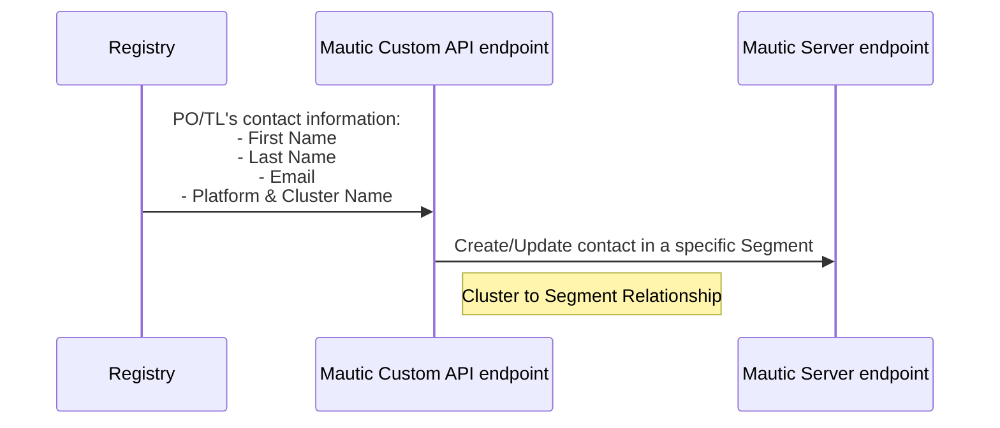

# Registry and Mautic Integration

We use Mautic to send out important notification emails to all Product Owners and Technical Leads from Private/Public Cloud Platforms. Registry being the front door recording POs and TLs' contact information, Mautic relies on it to keep the email contact update-to-date. When Mautic receives request from Registry, it'll decide which email segment to add the new contact into.

## Flow of the integration

### Cluster to Segment Relationship:

| Platform | Cluster | Segment |
|---|---|---|
| Private Cloud | Silver | critical-updates-generic, critical-updates-silver, platform-comms |
| Private Cloud | Gold & Golddr |critical-updates-generic, critical-updates-gold, platform-comms |
| Private Cloud | Emerald |critical-updates-generic, critical-updates-emerald, platform-comms |
| Public Cloud | AWS | public-cloud-accelerator-updates |
